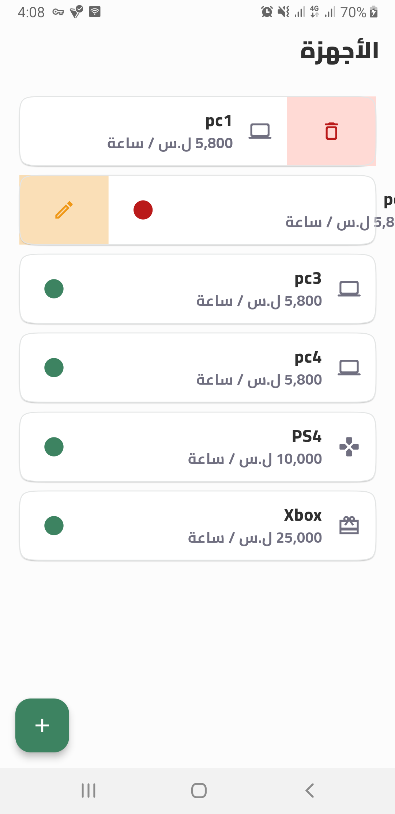
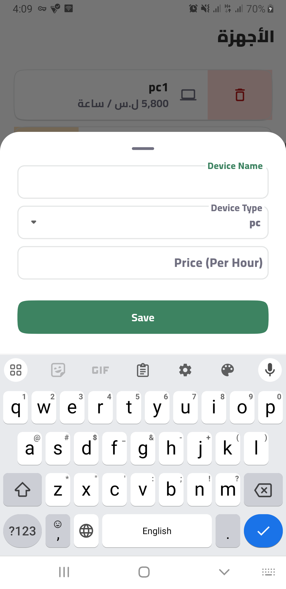

### Pray For Palestine


# Gaming Management

Welcome to **Gaming Management**, a training project designed to help you learn and master Flutter by building a comprehensive gaming management application. Throughout this project, you will gain hands-on experience with Flutter development and UI design.
## Contributers 
##### [Eng.Osama Rida](https://github.com/os01ri)
##### [Eng.Omar Kaialy](https://github.com/dev-OmarKaialy)
## Table of Contents

- [Introduction](#introduction)
- [Features](#features)
- [Installation](#installation)
- [Screenshots](#screenshots)
- [Contributing](#contributing)
- [Contact](#contact)

## Introduction

This course will guide you through the process of developing **Gaming Management**, a comprehensive gaming management application, using Flutter. You'll learn how to create a feature-rich app from scratch, implementing everything from splash screens to API integration and animations.

## Screenshots

<p align="center">
  
  
</p>
<!-- 
<p align="center">
  
  
</p> -->

## Features

- User-friendly interface with intuitive navigation.
- Add New Devices
- Change Status Of Device
- Remove Device

## Installation

To get a local copy up and running, follow these simple steps.

### Prerequisites

- Flutter SDK: [Installation Guide](https://flutter.dev/docs/get-started/install)
- Dart SDK (comes with Flutter)
- Android Studio or Visual Studio Code

### Clone the Repository

```bash
git clone https://github.com/dev-OmarKaialy/gameDevicesManagement.git
cd gameDevicesManagement
